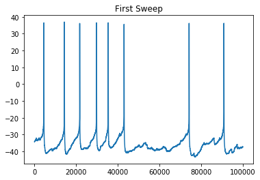
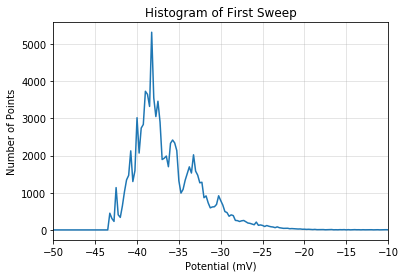
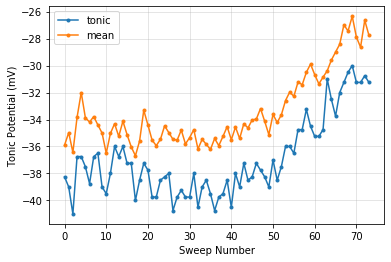
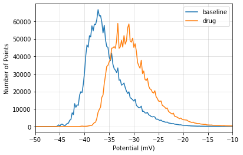

# Tonic Voltage Analysis

The goal of this notebook is to test if a histogram can be used to estimate resting voltage from sweeps of continuously-firing neurons.


```python
import numpy as np
import matplotlib.pyplot as plt
```

In this dataset every row is a sweep of voltages.


```python
data = np.load("sAPs.npy")
print(data)
```

    [[-34.28 -34.25 -34.25 ... -37.34 -37.34 -37.34]
     [-35.62 -35.6  -35.6  ... -25.72 -25.7  -25.72]
     [-34.34 -34.34 -34.34 ... -39.62 -39.62 -39.66]
     ...
     [-32.78 -32.8  -32.78 ... -28.97 -28.98 -28.98]
     [-31.34 -31.38 -31.38 ...  21.84  21.36  20.81]
     [-21.94 -21.94 -21.97 ... -25.7  -25.7  -25.67]]
    


```python
sweep = data[0, :]
plt.plot(sweep)
plt.title("First Sweep")
plt.show()
```





We start by creating a histogram using 0.25 mV bins spanning the range of expected values


```python
bins = np.arange(-100, 100, .25)
counts, edges = np.histogram(sweep, bins)
edges = edges[:-1]

plt.grid(alpha=.4)
plt.plot(edges,counts)
plt.ylabel("Number of Points")
plt.xlabel("Potential (mV)")
plt.axis([-50, -10, None, None])
plt.title("Histogram of First Sweep")
plt.show()
```





Tonic voltage can be estimated as the most common binned value in the sweep.


```python
maxCountIndex = np.argmax(counts)
peakVoltage = edges[maxCountIndex]
print(f"Tonic value: {peakVoltage} mV")
```

    Tonic value: -38.25 mV
    

If you want to get fancy you can fit a Gaussian curve to half of the historgram. Don't fit the whole histogram because, as you can see from its shape, the upper portion does not have a Gaussian distribution. See [Bright and Smart (2013)](https://www.ncbi.nlm.nih.gov/pmc/articles/PMC3852068/) Figure 1C.

For now simply taking the voltage that yields peak bin count will serve as our tonic voltage measurement.

## Tonic Voltage Over Time

The same idea can be repeated for every sweep and tonic voltage can be plotted over time.


```python
bins = np.arange(-100, 100, .25)
tonicBySweep = np.empty(data.shape[0])

for i, sweep in enumerate(data):
    counts, edges = np.histogram(sweep, bins)
    tonicBySweep[i] = edges[np.argmax(counts)]
    
plt.grid(alpha=.4)
plt.plot(tonicBySweep, '.-', label="tonic")
plt.plot(np.mean(data, axis=1), '.-', label="mean")
plt.legend()
plt.ylabel("Tonic Potential (mV)")
plt.xlabel("Sweep Number")
plt.show()
```





In this experiment notice that the tonic current is several mV more negative than the mean.

## Tonic Voltage Comparison

To improve the resolution of the tonic analysis we can merge many sweeps together (producing a smoother histogram).

Let's compare histograms of the first 20 sweeps to the last 20 sweeps.


```python
bins = np.arange(-100, 100, .25)

range1data = data[:20].flatten()
range2data = data[-20:].flatten()
    
range1counts, range1edges = np.histogram(range1data, bins)
range2counts, range2edges = np.histogram(range2data, bins)

plt.grid(alpha=.4)
plt.plot(range1edges[:-1], range1counts, label="baseline")
plt.plot(range2edges[:-1], range2counts, label="drug")
plt.ylabel("Number of Points")
plt.xlabel("Potential (mV)")
plt.legend()
plt.axis([-50, -10, None, None])
plt.show()
```





To produce a precise voltage you could fit the lower half of these histograms to a Gaussian curve and report the center. The upper half of the curve should not be fitted because values do not follow a Gaussian distribution ([Bright and Smart 2013](https://www.ncbi.nlm.nih.gov/pmc/articles/PMC3852068/))
