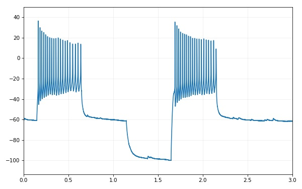
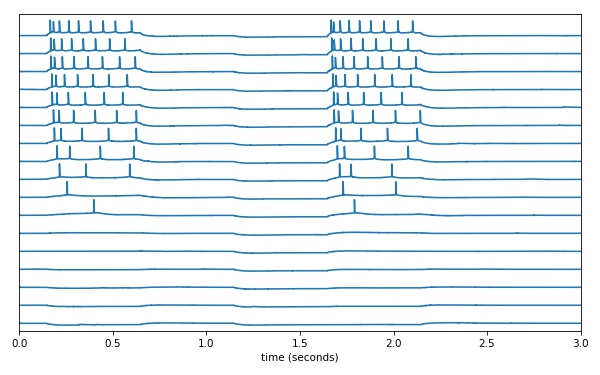
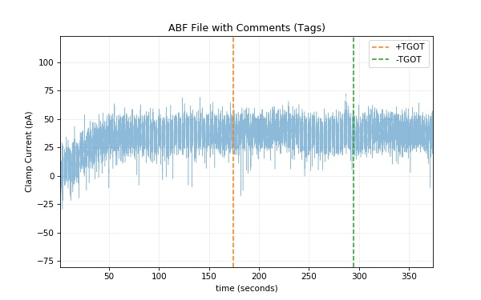
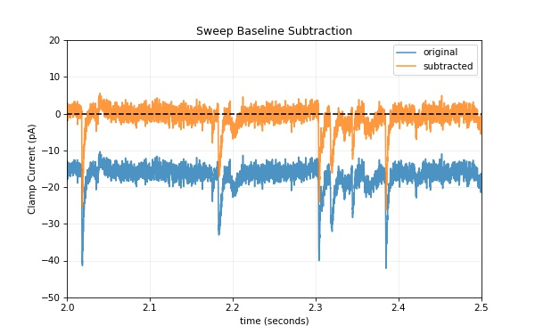
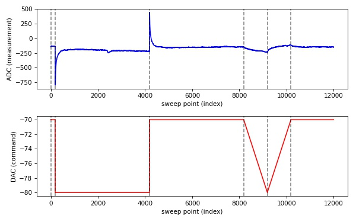
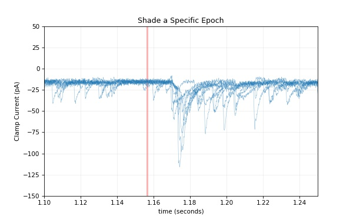
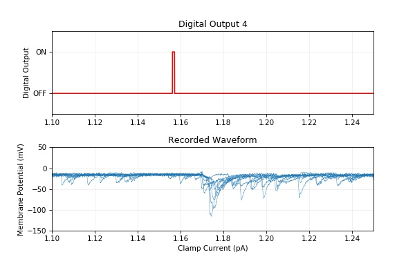
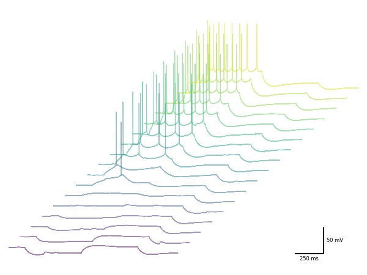
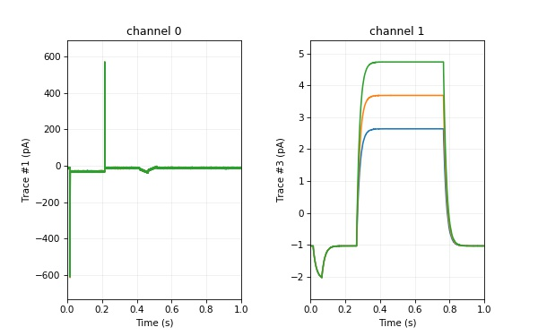
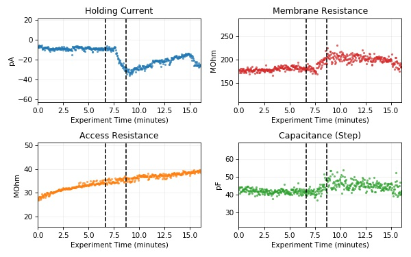

# pyABF Tutorial

**This page demonstrates how to use pyABF to perform many common tasks.** The first few examples are simple, but they increase in complexity further down the page. Looking over this page is the best way to get started with pyABF. Most pyABF functionality is demonstrated in this document. All ABFs used in these examples are provided in the [data folder](https://github.com/swharden/pyABF/tree/master/data), so you can practice recreating these examples in your own programming environment.

## Installation

pyABF supports Python 3.6+ and is available on [PyPi](https://pypi.org/project/pyabf/):

```
pip install --upgrade pyabf
```

## Quickstart
```python
import pyabf
abf = pyabf.ABF("demo.abf")
abf.setSweep(sweepNumber: 3, channel: 0)
print(abf.sweepY) # displays sweep data (ADC)
print(abf.sweepX) # displays sweep times (seconds)
print(abf.sweepC) # displays command waveform (DAC)
```

## Table of Contents


## Load an ABF File

```python
abf = pyabf.ABF("demo.abf")
print(abf)
```

Output:

```
ABF file (demo.abf) with 1 channel, 187 sweeps, and a total length of 6.23 min.
```

## Inspect the ABF Header
Sometimes it is useful to see all the data contained in the ABF header. While inspecting the header is not necessary to use pyabf, it is useful to know how to access this information.

```python
import pyabf
abf = pyabf.ABF("demo.abf")
print(abf.headerText) # display header information in the console
abf.headerLaunch() # display header information in a web browser
```

## Access Sweep Data
ABF objects provide access to ABF data by sweep number. Sweep numbers start at zero, and after setting a sweep you can access that sweep's ADC data with sweepY, DAC simulus waveform / command signal with sweepC, and the time units for the sweep with sweepX.

```python
import pyabf
abf = pyabf.ABF("18808025.abf")
abf.setSweep(14)
print("sweep data (ADC):", abf.sweepY)
print("sweep command (DAC):", abf.sweepC)
print("sweep times (seconds):", abf.sweepX)
```

Output:

```
sweep data (ADC): [-13.6719 -12.9395 -12.207  ..., -15.8691 -15.8691 -16.7236]
sweep command (DAC): [-70. -70. -70. ..., -70. -70. -70.]
sweep times (seconds): [ 0.      0.0001  0.0001 ...,  0.5998  0.5999  0.5999]
```

## Plot a Sweep with Matplotlib
Matplotlib is a fantastic plotting library for Python. This example shows how to plot an ABF sweep using matplotlib. The ABF's setSweep() is used to tell the ABF class what sweep to load into memory. After that you can just plot sweepX and sweepY.

```python
import pyabf
import matplotlib.pyplot as plt

abf = pyabf.ABF("17o05028_ic_steps.abf")
abf.setSweep(14)
plt.figure(figsize=(8, 5))
plt.plot(abf.sweepX, abf.sweepY)
plt.show()
```

<div class="text-center">



</div>

## Decorate Plots with ABF Information
The ABF class provides easy access to lots of information about the ABF. This example shows how to use these class methods to create a prettier plot of several sweeps from the same file.

```python
import pyabf
import matplotlib.pyplot as plt

abf = pyabf.ABF("17o05028_ic_steps.abf")
plt.figure(figsize=(8, 5))
plt.title("pyABF and Matplotlib are a great pair!")
plt.ylabel(abf.sweepLabelY)
plt.xlabel(abf.sweepLabelX)
for i in [0, 5, 10, 15]:
    abf.setSweep(i)
    plt.plot(abf.sweepX, abf.sweepY, alpha=.5, label="sweep %d" % (i))
plt.legend()
plt.show()
```

<div class="text-center">


</div>

## Plot Multi-Channel ABFs
Channel selection is achieved by defining a channel when calling setSweep().

```python
import pyabf
import matplotlib.pyplot as plt

abf = pyabf.ABF("14o08011_ic_pair.abf")
fig = plt.figure(figsize=(8, 5))

# plot the first channel
abf.setSweep(sweepNumber=0, channel=0)
plt.plot(abf.sweepX, abf.sweepY, label="Channel 1")

# plot the second channel
abf.setSweep(sweepNumber=0, channel=1)
plt.plot(abf.sweepX, abf.sweepY, label="Channel 2")

# decorate the plot
plt.ylabel(abf.sweepLabelY)
plt.xlabel(abf.sweepLabelX)
plt.axis([25, 45, -70, 50])
plt.legend()
plt.show()
```

<div class="text-center">


</div>

## Plot the Command Waveform

> ⚠ abf.sweepC holds the stimulus waveform generated from the epoch table, not data that has been recorded. If you recorded your command signal, it is likely stored in the ABF file as a secondary channel. To access data in additional ABF channels refer to the multi-channel example.

The command waveform for episodic ABF files can be accessed using abf.sweepC if the waveform editor was used to control clamp current or voltage when creating the ABF protocol. The waveform generated is equivalent to that created by the "create stimulus waveform signal" feature in ClampFit. For more information about the epoch table (such as the list of levels for each epoch, specific time points epochs start and stop, etc.) check out properties of the abf.sweepEpochs object, which represents the currently loaded sweep/channel.

```python
import pyabf
import matplotlib.pyplot as plt

abf = pyabf.ABF("14o08011_ic_pair.abf")
fig = plt.figure(figsize=(8, 5))

# plot the first channel
abf.setSweep(sweepNumber=0, channel=0)
plt.plot(abf.sweepX, abf.sweepY, label="Channel 1")

# plot the second channel
abf.setSweep(sweepNumber=0, channel=1)
plt.plot(abf.sweepX, abf.sweepY, label="Channel 2")

# decorate the plot
plt.ylabel(abf.sweepLabelY)
plt.xlabel(abf.sweepLabelX)
plt.axis([25, 45, -70, 50])
plt.legend()
plt.show()
```

<div class="text-center">


</div>

## Axis-Linked Subplots
Matplotlib allows you to create subplots with linked axes. This is convenient when plotting a waveform and its command stimulus at the same time, because zooming-in on one will zoom-in on the other. This is most useful when using interactive graphs, but works in all cases.

```python
import pyabf
import matplotlib.pyplot as plt

abf = pyabf.ABF("171116sh_0018.abf")
abf.setSweep(14)
fig = plt.figure(figsize=(8, 5))

# plot the ADC (voltage recording)
ax1 = fig.add_subplot(211)
ax1.set_title("ADC (recorded waveform)")
ax1.plot(abf.sweepX, abf.sweepY)

# plot the DAC (clamp current)
ax2 = fig.add_subplot(212, sharex=ax1)  # <-- this argument is new
ax2.set_title("DAC (stimulus waveform)")
ax2.plot(abf.sweepX, abf.sweepC, color='r')

# decorate the plots
ax1.set_ylabel(abf.sweepLabelY)
ax2.set_xlabel(abf.sweepLabelX)
ax2.set_ylabel(abf.sweepLabelC)
ax1.axes.set_xlim(1.25, 2.5)  # <-- adjust axis like this
plt.show()
```

<div class="text-center">


</div>

## Plot Stacked Sweeps

I often like to view sweeps stacked one on top of another. In ClampFit this is done with "distribute traces". Here we can add a bit of offset when plotting sweeps and achieve the same effect. This example makes use of abf.sweepList, which is the same as range(abf.sweepCount).

```python
import pyabf
import matplotlib.pyplot as plt

abf = pyabf.ABF("171116sh_0018.abf")
plt.figure(figsize=(8, 5))

# plot every sweep (with vertical offset)
for sweepNumber in abf.sweepList:
    abf.setSweep(sweepNumber)
    offset = 140*sweepNumber
    plt.plot(abf.sweepX, abf.sweepY+offset, color='C0')

# decorate the plot
plt.gca().get_yaxis().set_visible(False)  # hide Y axis
plt.xlabel(abf.sweepLabelX)
plt.show()
```

<div class="text-center">



</div>

## Plot Sweeps in 3D
The previous example how to plot stacked sweeps by adding a Y offset to each sweep. If you add an X and Y offset to each sweep, you can create a 3D effect.

```python
import pyabf
import matplotlib.pyplot as plt

abf = pyabf.ABF("171116sh_0018.abf")

plt.figure(figsize=(8, 5))
for sweepNumber in abf.sweepList:
    abf.setSweep(sweepNumber)
    i1, i2 = 0, int(abf.sampleRate * 1)  # plot part of the sweep
    dataX = abf.sweepX[i1:i2] + .025 * sweepNumber
    dataY = abf.sweepY[i1:i2] + 15 * sweepNumber
    plt.plot(dataX, dataY, color='C0', alpha=.5)

plt.gca().axis('off')  # hide axes to enhance floating effect
plt.show()
```

<div class="text-center">


</div>

## Custom Colormaps
Matplotlib's colormap tools can be used to add an extra dimension to graphs. All matplotlib colormaps are listed here. For an interesting discussion on choosing ideal colormaps for scientific data visit bids.github.io/colormap/. Good colors for e-phys are winter, rainbow, and viridis.

```python
import pyabf
import matplotlib.pyplot as plt

abf = pyabf.ABF("171116sh_0018.abf")

# use a custom colormap to create a different color for every sweep
cm = plt.get_cmap("winter")
colors = [cm(x/abf.sweepCount) for x in abf.sweepList]
# colors.reverse()

plt.figure(figsize=(8, 5))
for sweepNumber in abf.sweepList:
    abf.setSweep(sweepNumber)
    i1, i2 = 0, int(abf.sampleRate * 1)
    dataX = abf.sweepX[i1:i2] + .025 * sweepNumber
    dataY = abf.sweepY[i1:i2] + 15 * sweepNumber
    plt.plot(dataX, dataY, color=colors[sweepNumber], alpha=.5)

plt.gca().axis('off')
plt.show()
```

<div class="text-center">


</div>

## Plotting Gap-Free ABFs

The pyABF treats every ABF like it's episodic (with sweeps). As such, gap free ABF files are loaded as if they were episodic files with a single sweep. When an ABF is loaded, setSweep(0) is called automatically, so the entire gap-free set of data is already available by plotting sweepX and sweepY.

```python
import pyabf
import matplotlib.pyplot as plt

abf = pyabf.ABF("abf1_with_tags.abf")
plt.figure(figsize=(8, 5))
plt.plot(abf.sweepX, abf.sweepY, lw=.5)
plt.axis([725, 825, -150, -15])
plt.ylabel(abf.sweepLabelY)
plt.xlabel(abf.sweepLabelX)
plt.title("Example Gap Free File")
plt.show()
```

<div class="text-center">


</div>

## Accessing Comments (Tags) in ABF Files

While recording an ABF the user can insert a comment at a certain time point. pClamp calls these "tags", and they can be a useful way to mark when a drug was applied during an experiment. For this to work, sweepX needs to be a list of times in the ABF recording (not times which always start at 0 for every new sweep). Set this behavior by setting absoluteTime=True when calling setSweep(). A list of comments (the text of tags) is stored in a list abf.tagComments. The sweep for each tag is in abf.tagSweeps, while the time of each tag is in abf.tagTimesSec and abf.tagTimesMin.

```python
import pyabf
import matplotlib.pyplot as plt

abf = pyabf.ABF("16d05007_vc_tags.abf")

# create a plot with time on the horizontal axis
plt.figure(figsize=(8, 5))
for sweep in abf.sweepList:
    abf.setSweep(sweep, absoluteTime=True)  # <-- relates to sweepX
    plt.plot(abf.sweepX, abf.sweepY, lw=.5, alpha=.5, color='C0')
plt.margins(0, .5)
plt.ylabel(abf.sweepLabelY)
plt.xlabel(abf.sweepLabelX)

# now add the tags as vertical lines
for i, tagTimeSec in enumerate(abf.tagTimesSec):
    posX = abf.tagTimesSec[i]
    comment = abf.tagComments[i]
    color = "C%d" % (i+1)
    plt.axvline(posX, label=comment, color=color, ls='--')
plt.legend()

plt.title("ABF File with Comments (Tags)")
plt.show()
```

<div class="text-center">



</div>

## Baseline Subtraction

Sometimes it is worthwhile to center every sweep at 0. This can be done easily giving a time range to baseline subtract to when calling setSweep().

```python
import pyabf
import matplotlib.pyplot as plt

abf = pyabf.ABF("17o05026_vc_stim.abf")
plt.figure(figsize=(8, 5))

# plot a sweep the regular way
abf.setSweep(3)
plt.plot(abf.sweepX, abf.sweepY, alpha=.8, label="original")

# plot a sweep with baseline subtraction
abf.setSweep(3, baseline=[2.1, 2.15])
plt.plot(abf.sweepX, abf.sweepY, alpha=.8, label="subtracted")

# decorate the plot
plt.title("Sweep Baseline Subtraction")
plt.axhline(0, color='k', ls='--')
plt.ylabel(abf.sweepLabelY)
plt.xlabel(abf.sweepLabelX)
plt.legend()
plt.axis([2, 2.5, -50, 20])
plt.show()
```

<div class="text-center">



</div>

## Gaussian Filter (Lowpass Filter / Data Smoothing)

Noisy data can be filtered in software. This is especially helpful for inspection of evoked or spontaneuos post-synaptic currents. To apply low-pass filtering on a specific channel, invoke the abf.filter.gaussian() method before calling setSweep(). The degree of smoothing is defined by sigma (milliseconds units), passed as an argument: abf.filter.gaussian(abf, sigma). When an ABF file is loaded its entire data is loaded into memory. When the gaussian filter is called, the entire data is smoothed in memory. This means calling the filter several times with the same sigma will make it progressively smoother (although extremely processor-intensive). Set sigma to 0 to remove all filters. This will cause the original data to be re-read from the ABF file.

```python
import pyabf
import pyabf.filter
import matplotlib.pyplot as plt

abf = pyabf.ABF("17o05026_vc_stim.abf")
plt.figure(figsize=(8, 5))

# plot the original data
abf.setSweep(3)
plt.plot(abf.sweepX, abf.sweepY, alpha=.3, label="original")

# show multiple degrees of smoothless
for sigma in [.5, 2, 10]:
    pyabf.filter.gaussian(abf, 0)  # remove old filter
    pyabf.filter.gaussian(abf, sigma)  # apply custom sigma
    abf.setSweep(3)  # reload sweep with new filter
    label = "sigma: %.02f" % (sigma)
    plt.plot(abf.sweepX, abf.sweepY, alpha=.8, label=label)

# zoom in on an interesting region and decorate the plot
plt.title("Gaussian Filtering of ABF Data")
plt.ylabel(abf.sweepLabelY)
plt.xlabel(abf.sweepLabelX)
plt.axis([8.20, 8.30, -45, -5])
plt.legend()
plt.show()
```

<div class="text-center">


</div>

## Accessing the Command Epoch Table

In some ABFs an epoch table is used to control the command level of the DAC to control voltage or current. While the epoch table can be confusing to access directly from the header (e.g., the first epoch does not start at time 0, but rather 1/64 of the sweep length), a simplified way to access epoch types and levels is provided with the abf.sweepEpochs object, which contains epoch points, levels, and types for the currently-loaded sweep.

The simplest way to access epoch values (arranged as a list where every item represents one epoch) is to get properties of abf.sweepEpochs:

```python
import pyabf
abf = pyabf.ABF("2018_08_23_0009.abf")
for i, p1 in enumerate(abf.sweepEpochs.p1s):
    epochLevel = abf.sweepEpochs.levels[i]
    epochType = abf.sweepEpochs.types[i]
    print(f"epoch index {i}: at point {p1} there is a {epochType} to level {epochLevel}")
```

Output:

```
epoch index 0: at point 0 there is a Step to level -70.0
epoch index 1: at point 187 there is a Step to level -80.0
epoch index 2: at point 4187 there is a Step to level -70.0
epoch index 3: at point 8187 there is a Ramp to level -80.0
epoch index 4: at point 9187 there is a Ramp to level -70.0
epoch index 5: at point 10187 there is a Step to level -70.0
```

Here's another example which shows mark when epochs begin and end:

```python
import pyabf
import matplotlib.pyplot as plt

abf = pyabf.ABF("2018_08_23_0009.abf")

fig = plt.figure(figsize=(8, 5))

ax1 = fig.add_subplot(211)
ax1.plot(abf.sweepY, color='b')
ax1.set_ylabel("ADC (measurement)")
ax1.set_xlabel("sweep point (index)")

ax2 = fig.add_subplot(212)
ax2.plot(abf.sweepC, color='r')
ax2.set_ylabel("DAC (command)")
ax2.set_xlabel("sweep point (index)")

for p1 in abf.sweepEpochs.p1s:
    ax1.axvline(p1, color='k', ls='--', alpha=.5)
    ax2.axvline(p1, color='k', ls='--', alpha=.5)

plt.tight_layout()
plt.show()
```

<div class="text-center">



</div>

## Shading Epochs
In this ABF digital output 4 is high during epoch C. Let's highlight this by plotting sweeps and shading that epoch. print(abf.epochPoints) yields [0, 3125, 7125, 23125, 23145, 200000] and I know the epoch I'm interested in is bound by index 3 and 4.

```python
import pyabf
import matplotlib.pyplot as plt

abf = pyabf.ABF("17o05026_vc_stim.abf")

plt.figure(figsize=(8, 5))
for sweepNumber in abf.sweepList:
    abf.setSweep(sweepNumber)
    plt.plot(abf.sweepX, abf.sweepY, color='C0', alpha=.5, lw=.5)
plt.ylabel(abf.sweepLabelY)
plt.xlabel(abf.sweepLabelX)
plt.title("Shade a Specific Epoch")
plt.axis([1.10, 1.25, -150, 50])

epochNumber = 3
t1 = abf.sweepEpochs.p1s[epochNumber] * abf.dataSecPerPoint
t2 = abf.sweepEpochs.p2s[epochNumber] * abf.dataSecPerPoint
plt.axvspan(t1, t2, color='r', alpha=.3, lw=0)
plt.grid(alpha=.2)
plt.show()
```

<div class="text-center">



</div>

## Accessing Digital Outputs
Epochs don't just control DAC clamp settings, they also control digital outputs. Digital outputs are stored as an 8-bit byte with 0 representing off and 1 representing on. Calling abf.sweepD(digOutNum) will return a waveform (scaled 0 to 1) to show the high/low state of the digital output number given (usually 0-7). Here a digital output controls an optogenetic stimulator, and a light-evoked EPSC is seen several milliseconds after the stimulus

This example demonstrates how to use the pyabf.plot module to add an L-shaped scalebar:

```python
import pyabf
import matplotlib.pyplot as plt

abf = pyabf.ABF("17o05026_vc_stim.abf")

fig = plt.figure(figsize=(8, 5))

ax1 = fig.add_subplot(211)
ax1.grid(alpha=.2)
ax1.set_title("Digital Output 4")
ax1.set_ylabel("Digital Output")

# plot the digital output of the first sweep
ax1.plot(abf.sweepX, abf.sweepD(4), color='r')
ax1.set_yticks([0, 1])
ax1.set_yticklabels(["OFF", "ON"])
ax1.axes.set_ylim(-.5, 1.5)

ax2 = fig.add_subplot(212, sharex=ax1)
ax2.grid(alpha=.2)
ax2.set_title("Recorded Waveform")
ax2.set_xlabel(abf.sweepLabelY)
ax2.set_ylabel(abf.sweepLabelC)

# plot the data from every sweep
for sweepNumber in abf.sweepList:
    abf.setSweep(sweepNumber)
    ax2.plot(abf.sweepX, abf.sweepY, color='C0', alpha=.8, lw=.5)

# zoom in on an interesting region
ax2.axes.set_xlim(1.10, 1.25)
ax2.axes.set_ylim(-150, 50)
plt.show()
```

<div class="text-center">



</div>

## Advanced Plotting with the pyabf.plot Module
pyabf has a plot module which has been designed to simplify the act of creating matplotlib plots of electrophysiological data loaded with the ABF class. This module isn't fully developed or tested, but it's a strong start and has some interesting functionality that might be worth inspecting. If you care a lot about how your graphs look, plot them yourself with matplotlib commands. If you want to save keystrokes, don't care how the graphs look, or don't know how to use matplotlib (and don't feel like learning), maybe some of the functions in the pyabf.plot module may be useful to you. You don't have to import it, just call its functions and pass-in the abf object you're currently working with.

> **⚠ WARNING:** The ptabf.plot module is only partially developed and may not be suitable for use in production environments. Instead, users are encouraged to write their own plotting functions.
This example demonstrates how to use the pyabf.plot module to add an L-shaped scalebar:

```python
import pyabf
import pyabf.plot
import matplotlib.pyplot as plt
abf = pyabf.ABF("171116sh_0018.abf")

pyabf.plot.sweeps(abf, title=False, offsetXsec=.1, offsetYunits=20, startAtSec=0, endAtSec=1.5)
pyabf.plot.scalebar(abf, hideFrame=True)
plt.tight_layout()
plt.show()
```

<div class="text-center">



</div>

## Create an I/V Curve

This example analyzes 171116sh_0013.abf (a voltage clamp ABF which goes from -110 mV to -50 mV increasing the clamp voltage by 5 mV each sweep). To get the "I" the sweep is averaged between 500ms and 1s, and to get the "V" the second epoch is accessed.

This example demonstrates how to use the pyabf.plot module to add an L-shaped scalebar:

```python
import pyabf
import matplotlib.pyplot as plt

abf = pyabf.ABF("171116sh_0013.abf")
pt1 = int(500 * abf.dataPointsPerMs)
pt2 = int(1000 * abf.dataPointsPerMs)

currents = []
voltages = []
for sweep in abf.sweepList:
    abf.setSweep(sweep)
    currents.append(np.average(abf.sweepY[pt1:pt2]))
    voltages.append(abf.sweepEpochs.levels[2])

plt.figure(figsize=(8, 5))
plt.grid(alpha=.5, ls='--')
plt.plot(voltages, currents, '.-', ms=15)
plt.ylabel(abf.sweepLabelY)
plt.xlabel(abf.sweepLabelC)
plt.title(f"I/V Relationship of {abf.abfID}")

plt.show()
```

<div class="text-center">


</div>

## Analyze Data from ATF Files
Although most of the effort in this project has gone into the ABF class, there also exists an ATF class with much of the similar functionality. This class can read Axon Text Format (ATF) files and has a setSweep() with nearly identical sentax to the ABF class.

Extra attention was invested into supporting muli-channel ATF data. Note that this example plots only channel 2 from a multi-channel ATF file.

```python
import pyabf
import matplotlib.pyplot as plt

atf = pyabf.ATF("18702001-step.atf")  # not ABF!

fig = plt.figure(figsize=(8, 5))
ax1 = fig.add_subplot(121)
ax2 = fig.add_subplot(122)

for channel, ax in enumerate([ax1, ax2]):
    ax.set_title("channel %d" % (channel))
    ax.set_xlabel(atf.sweepLabelX)
    ax.set_ylabel(atf.sweepLabelY)
    for sweepNumber in atf.sweepList:
        atf.setSweep(sweepNumber, channel)
        ax.plot(atf.sweepX, atf.sweepY)

ax1.margins(0, .1)
ax2.margins(0, .1)
ax1.grid(alpha=.2)
ax2.grid(alpha=.2)
plt.show()
```

<div class="text-center">



</div>

## Membrane Test
The pyabf.tools.memtest module has methods which can determine passive membrane properties (holding current, membrane resistance, access resistance, whole-cell capacitance) from voltage-clamp traces containing a hyperpolarizing step. Theory and implimentation details are in the comments of the module. This example demonstrates how to graph passive membrane properties sweep-by-sweep, and indicate where comment tags were added.

```python
import pyabf
import pyabf.tools.memtest
import matplotlib.pyplot as plt

abf = pyabf.ABF("vc_drug_memtest.abf")
memtest = pyabf.tools.memtest.Memtest(abf)

# That's it! The rest of the code just plots these 4 numpy arrays.
fig = plt.figure(figsize=(8, 5))

ax1 = fig.add_subplot(221)
ax1.grid(alpha=.2)
ax1.plot(abf.sweepTimesMin, memtest.Ih.values,
         ".", color='C0', alpha=.7, mew=0)
ax1.set_title(memtest.Ih.name)
ax1.set_ylabel(memtest.Ih.units)

ax2 = fig.add_subplot(222)
ax2.grid(alpha=.2)
ax2.plot(abf.sweepTimesMin, memtest.Rm.values,
         ".", color='C3', alpha=.7, mew=0)
ax2.set_title(memtest.Rm.name)
ax2.set_ylabel(memtest.Rm.units)

ax3 = fig.add_subplot(223)
ax3.grid(alpha=.2)
ax3.plot(abf.sweepTimesMin, memtest.Ra.values,
         ".", color='C1', alpha=.7, mew=0)
ax3.set_title(memtest.Ra.name)
ax3.set_ylabel(memtest.Ra.units)

ax4 = fig.add_subplot(224)
ax4.grid(alpha=.2)
ax4.plot(abf.sweepTimesMin, memtest.CmStep.values,
         ".", color='C2', alpha=.7, mew=0)
ax4.set_title(memtest.CmStep.name)
ax4.set_ylabel(memtest.CmStep.units)

for ax in [ax1, ax2, ax3, ax4]:
    ax.margins(0, .9)
    ax.set_xlabel("Experiment Time (minutes)")
    for tagTime in abf.tagTimesMin:
        ax.axvline(tagTime, color='k', ls='--')

plt.tight_layout()
plt.show()
```

<div class="text-center">



</div>

## Stimulus File Folders and Caching
The stimulus waveform (abf.sweepC) is usually generated from the epoch table, but if a file was used for the stimlus waveform (abf or atf), pyABF will read that file to generate the proper abf.sweepC. The path to the stimulus file is stored in the header of the ABF, however this path can change between recording and analyis. This is especially true when a recording happens on windows and analysis occurs on Linux. You can tell pyABF which folders to look in to find the stimulus waveform as an argument when loading the ABF. Since reading of stimulus files (especially ATF files) can be slow, stimulus files are cached at the module level. This means they're only actually read once. To disable this functionality, load the ABF with pyabf.ABF(abfFilePath, cacheStimulusFiles = False)

```python
import pyabf
import matplotlib.pyplot as plt

abf = pyabf.ABF("H19_29_150_11_21_01_0011.abf",
                stimulusFileFolder="data/stimulusFiles")

fig = plt.figure(figsize=(8, 5))

ax1 = fig.add_subplot(211)
ax1.set_title("ABF Recording")
ax1.set_ylabel(abf.sweepLabelY)
ax1.plot(abf.sweepX, abf.sweepY, 'b', lw=.5)

ax2 = fig.add_subplot(212)
ax2.set_title("Stimulus Waveform")
ax2.set_ylabel(abf.sweepLabelC)
ax2.plot(abf.sweepX, abf.sweepC, 'r', lw=.5)

plt.tight_layout()
plt.show()
```

<div class="text-center">


</div>

## Advanced Topics
Additional examples and advanced discussions can be found on the advanced topics page.